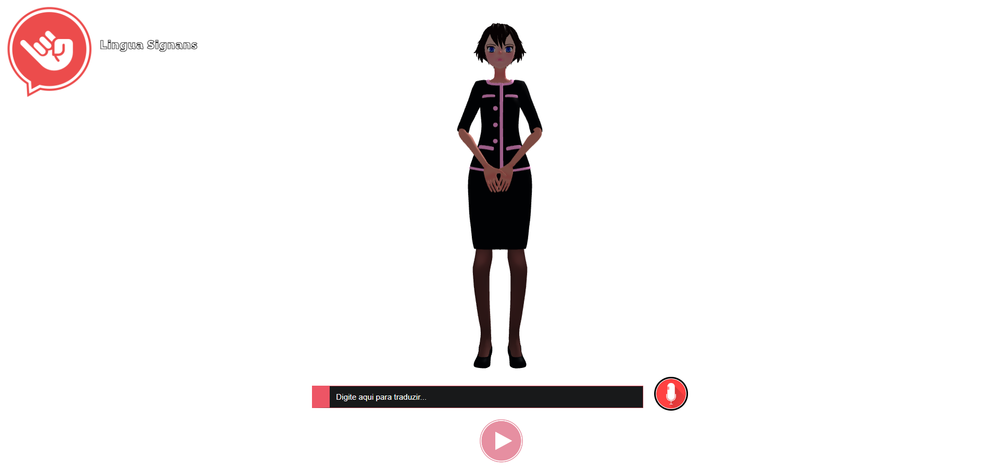

<h1 align="center">Lingua Signans</h1>

<h3 align="center"> 
	🚧  lingua_signans está em desenvolvimento 🚧
</h3>

 

># 📖 Sobre 

Sistema para tradução de áudio e escrita em português para LIBRAS (Língua Brasileira de Sinais), sendo construído com JavaScript, Three.js e Blender.

 

># Layout 

 

 

># 📋 Pré-requisitos 

Para exibir com sucesso o modelo 3D em seu navegador é necessário acessar o projeto através de um servidor web local, alguns exemplos seriam: [PHP server](https://www.php.net/manual/pt_BR/features.commandline.webserver.php), [Apache](https://httpd.apache.org/), [Live Server](https://marketplace.visualstudio.com/items?itemName=ritwickdey.LiveServer), etc.

  

># 🛠 Tecnologias e Ferramentas 

- [JavaScript](https://developer.mozilla.org/pt-BR/docs/Web/JavaScript) - Linguagem de programação usada para desenvolver a lógica do sistema. 
- [Three.js](https://threejs.org/) - Biblioteca JavaScript utilizada para exibir o modelo 3D no navegador web. 
- [Blender](https://www.blender.org/) - Programa de modelagem para criação do modelo 3D e suas animações. 

 

># Desenvolvedores 

| [ Thiago Santos](https://github.com/thiagohjsantos) | [ Douglas Borges](https://github.com/DouglasB19) | 
| :---: | :---: |